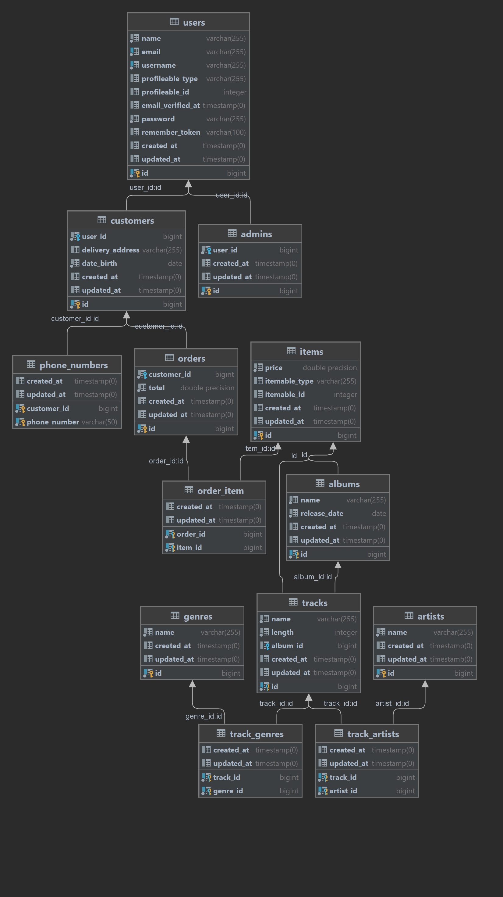

# 'Music store' application made in Laravel.

- set your DB connection settings in the `.env` file
- `php artisan key:generate`
- `php artisan migrate:fresh --seed`
- `php artisan serve`

#### The database seeders will create entries for every table.

### Admin user login:

    - email: root@example.com  
    - password: admin  

### Customer user login:

    - email: customer@example.com  
    - password: password  

### Database Diagram

